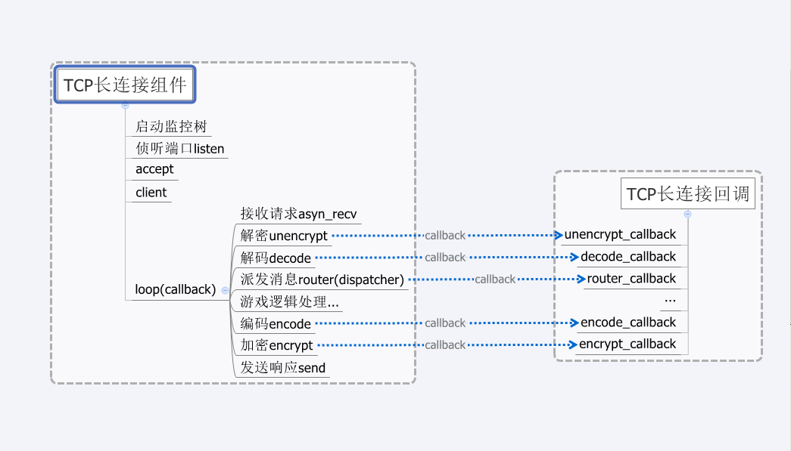

# Aque TCP

A TCP network component for game server written in Erlang.

Aque - A set of components for Game Server written in Erlang.

## Callback

About Callback Module Behaviour see tcp_client_behaviour.erl.

## Structure

